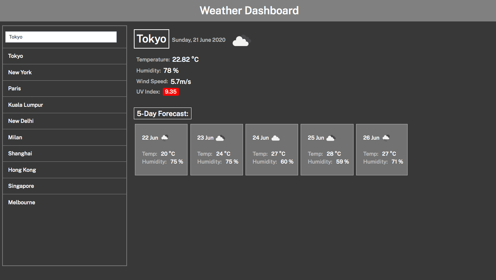

# homework6-Weather-Dashboard
Monash University Bootcamp homework 6

Created a weather dashboard app where users can search a city and be returned the current weather and 5-day weather
forecast for the city. This app features the use of a third party API for weather data (OpenWeather API), jQuery,
responsive layout, and local storage.

Link to deployed site: https://y-ilin.github.io/homework6-Weather-Dashboard/
